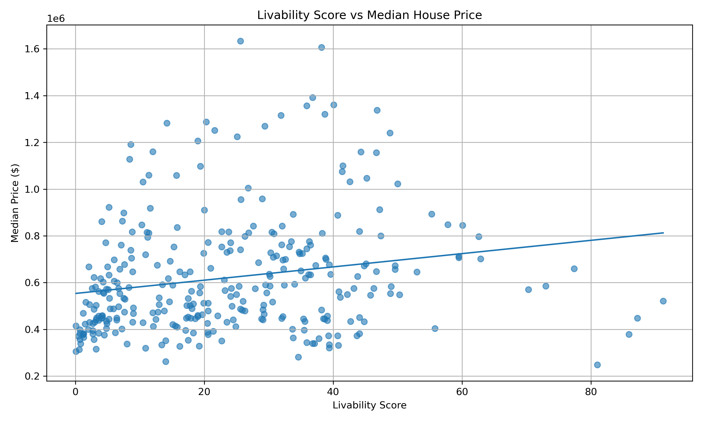
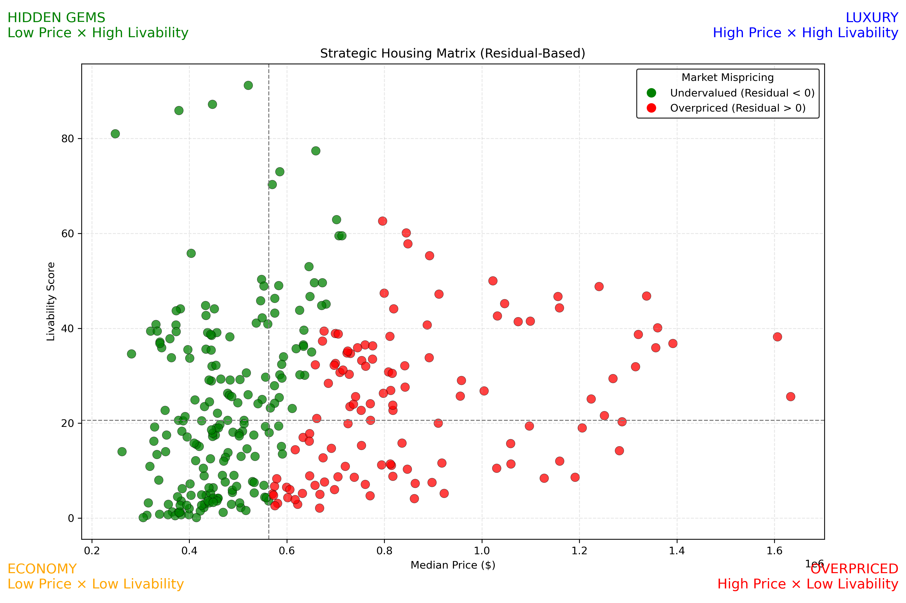
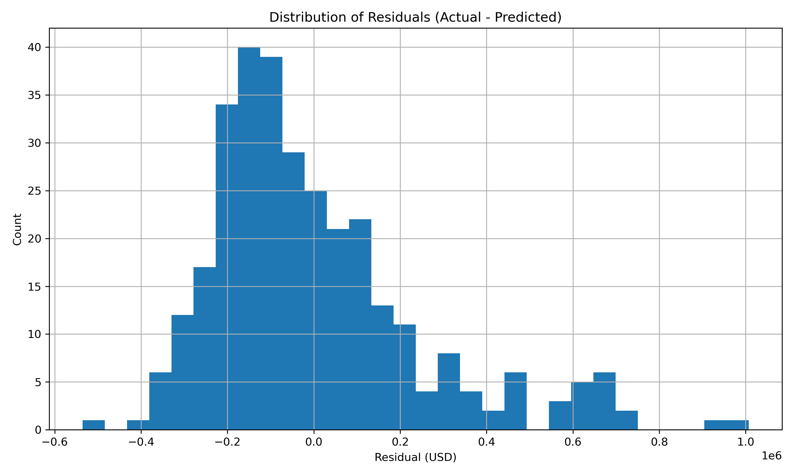
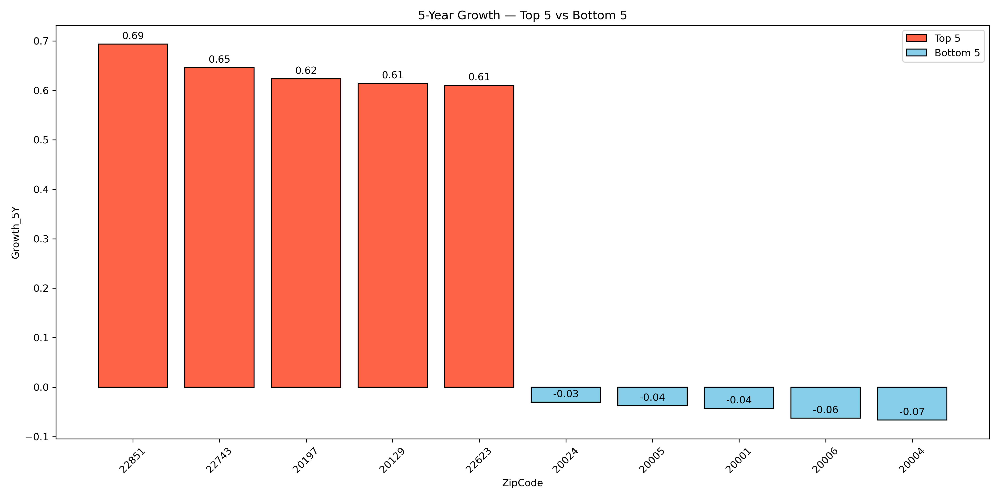
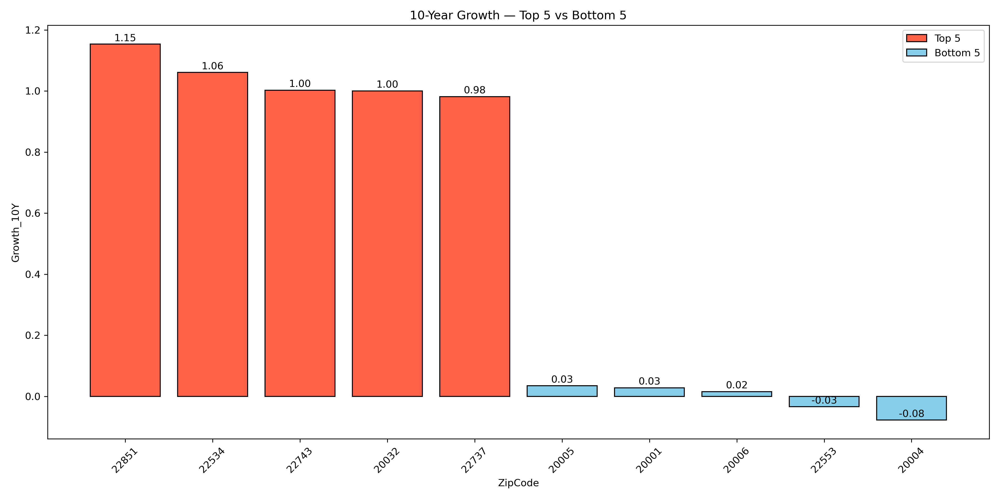

# Price–Livability Mismatch Analysis 

## **1 Regression Model**

To test whether livability explains housing price:

$\text{MedianPrice} = \beta_0 + \beta_1 \cdot \text{LivabilityScore}$

This is chosen because:
- Interpretable  
- Measures *expected* price based only on livability  
- Allows clean residual analysis

---

## **2 Residual Definition**

Residual is defined as:  
$\text{Residual} = \text{Actual Price} - \text{Predicted Price}$

Interpretation:

| Residual Value | Meaning | Market Insight |
|----------------|---------|----------------|
| **Residual < 0** | Undervalued | Good livability but cheaper than expected |
| **Residual > 0** | Overpriced | Lower livability but higher-than-expected price |

---

## **3. Results**

### Price vs Livability Regression


### Price vs Housing Matrix


### Residual Distribution


# Housing Growth vs. Livability Analysis
Urban Computing — DMV Region Housing Study

This analysis evaluates how housing price growth (5-year and 10-year) relates to Livability Scores across 313 DMV metropolitan ZIP codes.

---


## Objective

Determine whether higher livability predicts stronger **5-year** or **10-year** housing price appreciation.

---

## 5-Year Growth Results

**Model Equation**  
Growth_5Y = β₀ + β₁ × LivabilityScore

**Coefficients**  
- β₀ = 0.49406  
- β₁ = -0.005855  

**Model Fit**  
- R² = 0.62069

---
### Interpretation
- **β₀ (Intercept = 0.494)**  
  When livability = 0, expected 5-year growth ≈ **49.4%**.

- **β₁ (Slope = -0.00586)**  
  Each **+1 livability point** is associated with **–0.586% lower 5-year growth**.  
  (Negative correlation)

- **R² = 0.62**  
  Livability explains **62% of the variation** in 5-year growth → strong effect.

### Conclusion (5Y)
High-livability areas grow **significantly slower** than low-livability areas.

---

### Top 5 ZIP Codes (5Y Growth)

| ZipCode | City | Livability | Growth_5Y |
|--------|------|------------|-----------|
| 22851 | Stanley, VA | 14.0 | 0.694 |
| 22743 | Etlan, VA | 0.8 | 0.646 |
| 20197 | Waterford, VA | 21.6 | 0.623 |
| 20129 | Waterford, VA | 8.6 | 0.614 |
| 22623 | Chester Gap, VA | 3.2 | 0.610 |

**Observation:**  
Top growth ZIPs are rural or exurban with low livability. Growth appears affordability-driven, not amenity-driven.

---

### Bottom 5 ZIP Codes (5Y Growth)

| ZipCode | City | Livability | Growth_5Y |
|--------|------|-------------|-----------|
| 20006 | Washington, DC | 81.0 | -0.063 |
| 20004 | Washington, DC | 87.2 | -0.067 |
| 20001 | Washington, DC | 77.4 | -0.043 |
| 20005 | Washington, DC | 91.2 | -0.038 |
| 20024 | Washington, DC | 55.8 | -0.030 |

**Observation:**  
High-livability downtown DC areas show minimal or negative price growth.

### 5Y

---

## 10-Year Growth Results

**Model Equation**  
Growth_10Y = β₀ + β₁ × LivabilityScore

**Coefficients**  
- β₀ = 0.75646  
- β₁ = -0.004604  

**Model Fit**  
- R² = 0.34886
- 
---

### Interpretation
- **β₀ = 0.756**  
  When livability = 0, expected 10-year growth ≈ **75.6%**.

- **β₁ = -0.00460**  
  Each +1 livability point → **–0.46% 10-year growth**.

- **R² = 0.35**  
  Livability explains **35% of long-term growth** → still meaningful, but weaker than 5-year.

### Conclusion (10Y)
The negative relationship persists over a decade, but becomes less dominant.

---


### Top 5 ZIP Codes (10Y Growth)

| ZipCode | City | Livability | Growth_10Y |
|--------|------|-------------|-------------|
| 22851 | Stanley, VA | 14.0 | 1.154 |
| 22534 | Partlow, VA | 1.3 | 1.061 |
| 22743 | Etlan, VA | 0.8 | 1.003 |
| 20032 | Washington, DC | 37.1 | 1.001 |
| 22737 | Rixeyville, VA | 2.9 | 0.982 |

**Observation:**  
Long-term performance remains dominated by rural, low-livability ZIP codes.

---

### Bottom 5 ZIP Codes (10Y Growth)

| ZipCode | City | Livability | Growth_10Y |
|--------|------|-------------|-------------|
| 20004 | Washington, DC | 87.2 | -0.078 |
| 22553 | Fredericksburg, VA | 2.7 | -0.034 |
| 20006 | Washington, DC | 81.0 | 0.016 |
| 20001 | Washington, DC | 77.4 | 0.028 |
| 20005 | Washington, DC | 91.2 | 0.035 |

**Observation:**  
Downtown DC consistently underperforms in long-term growth.

### 10Y

---

## Comparative Insights (5Y vs 10Y)

### Insight 1 — Livability does not predict growth  
High-livability ZIP codes do **not** show superior appreciation.

### Insight 2 — Rural/exurban areas outperform  
Likely driven by affordability and migration patterns.

### Insight 3 — DC core consistently underperforms  
ZIPs such as 20001, 20004, 20005, 20006 repeatedly appear in bottom rankings.

### Insight 4 — 10-Year horizon confirms trends  
The negative relationship between livability and growth is stable over time.

---

## Final Conclusion

High livability **does not** lead to high property growth.  
Instead, appreciation is influenced by:

- Affordability  
- Suburban/exurban migration  
- Redevelopment and land availability  
- Market pressures unrelated to everyday amenities


```md
